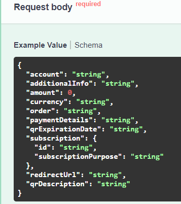
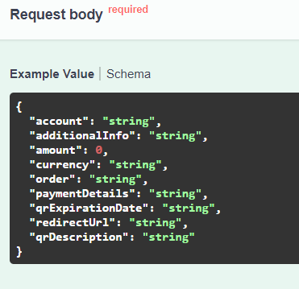
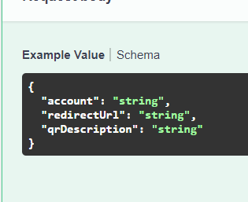
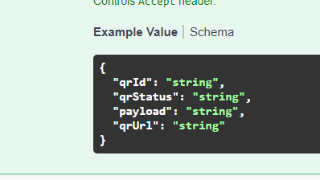

## Что реализовано:
1) API может создавать все типы QR. 

Создание динамического qr: http://localhost:8081/payment-api/v1/qrs/dynamic

Тело запроса (обязательные параметры amount и order):

Создание статического qr (обязательные параметры amount и order): http://localhost:8081/payment-api/v1/qrs/static

Тело запроса:

Создание третьей хуйни: http://localhost:8081/payment-api/v1/qrs/variable

Тело запроса:

Вывод у всез 3х типов один:

Поменяйте только хост

Порт: 8081

Обязательные параметры у каждого из типов QR можно посмотреть в документации:
https://pay.raif.ru/doc/sbp.html#tag/qr-creation

2) API может предоставлять информацию о QR

Запрос отправляется по адресу: api/v1/qrs/{qrId}

3) Добавлена поддержка Swagger
4) Добавлена обработка исключений SbpClient
5) API взаимодействует с databaseAPI:
- загружает созданные QR
- обновляет информацию о QR каждые 5 секунд

