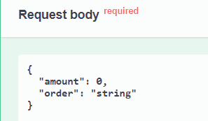

## Что реализовано:
1) API может создавать динамический QR. 

Запрос отправляется по адресу: api/v1/qrs/dynamic 

Локальный порт: 8081

Пример самого простого запроса, где указаны только обязательные параметры:

2) Добавлена поддержка Swagger
3) Добавлена обработка исключений SbpClient

